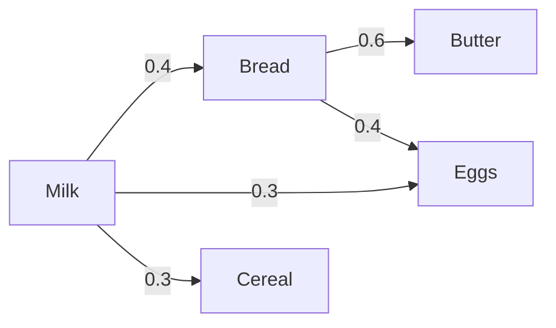
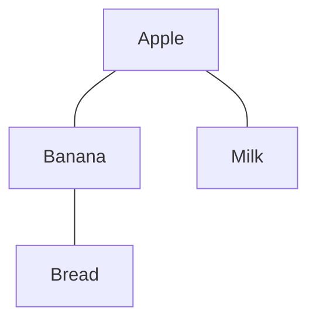
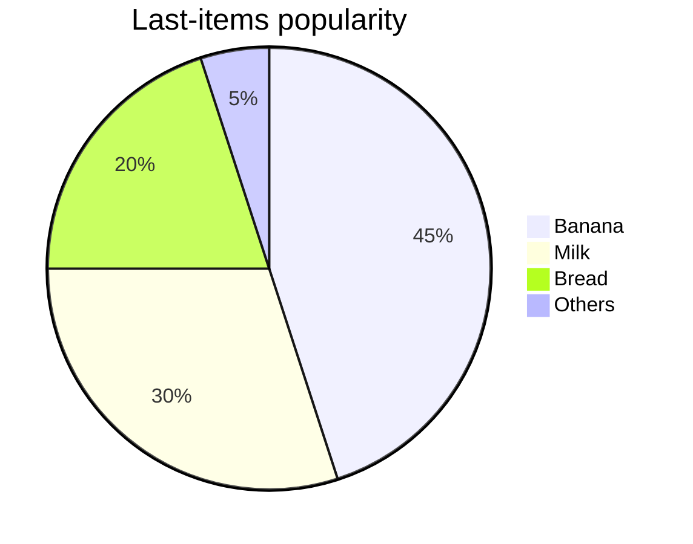
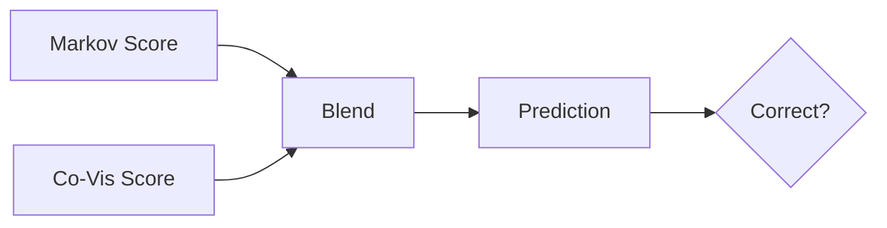
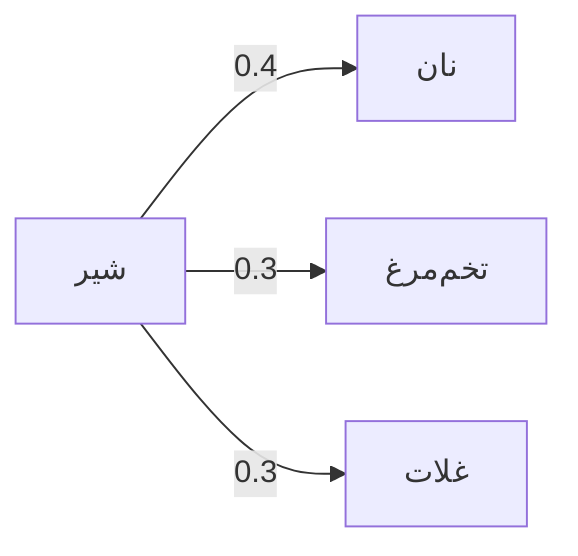
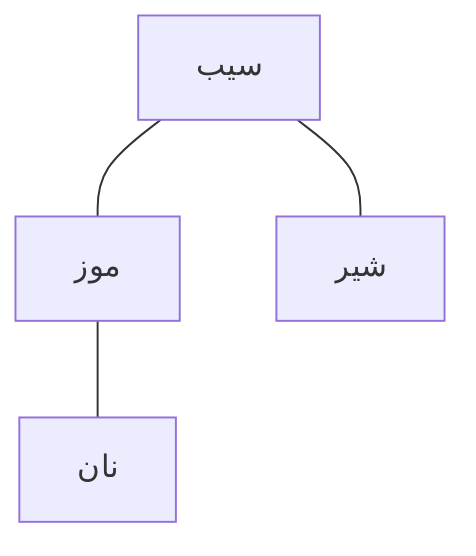
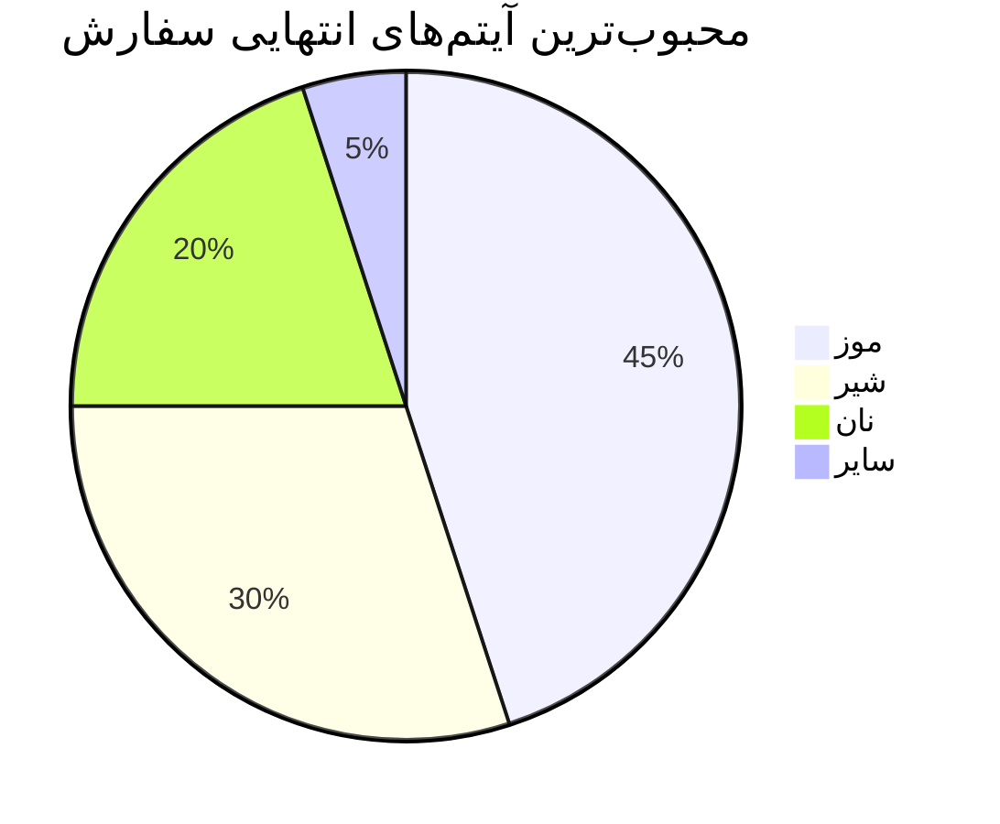
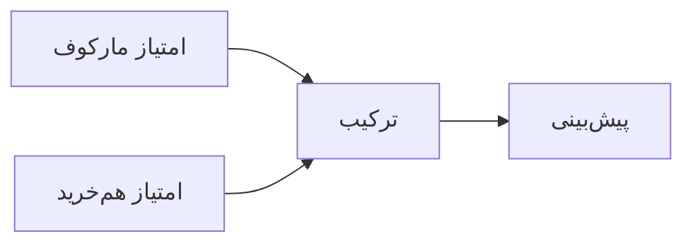

# 📦 Next-Product Prediction Project

## 📖 Overview

This project implements a **sequence-based recommendation system** that predicts the **next product** a user will add to cart, given their order sequence. It targets Instacart-like datasets and evaluates accuracy while **hiding the last *k* items** (k ∈ {1,2,3}) to simulate different levels of context.

The system combines **three algorithms** and blends their scores:

1. **Markov Chain (first-order transitions)** — learns $P(\text{next}\mid\text{current})$ from observed sequences, pruned to Top‑N neighbors and smoothed.
2. **Co‑Visitation (windowed co-occurrence)** — upweights items that appear close together within an order (distance weighting + optional reorder boost).
3. **Popularity Backoff** — when no candidates exist, choose the most popular last item across orders.

Final score used for ranking:

$\text{Score}(j) = \texttt{blend_markov} \cdot S_{\text{markov}}(j) + \texttt{blend_cov} \cdot S_{\text{cov}}(j)$

Deterministic tie-break: **blended desc → Markov desc → Popularity desc → product\_id asc**.

---

## ⚙️ Algorithms in Detail (with diagrams)

### 🔗 Markov Chain



*Transition probabilities are learned per product; neighbors are Top‑N and normalized.*

### 🛒 Co‑Visitation (window-based)



*Edges reflect co-occurrence within a sliding window; closer pairs get higher weights; items with `reordered>0` can be boosted.*

### ⭐ Popularity Backoff



*If no Markov / Co‑Vis candidates, predict the globally most common last item.*

### 🧮 Blending and Decision



---

## 🛠️ Installation

### Option A) Quick start with `venv`

```bash
python3 -m venv venv
source venv/bin/activate   # Linux / macOS
venv\\Scripts\\activate      # Windows
pip install -r requirements.txt
```

**Suggested `requirements.txt`:**

```text
pandas>=2.0
numpy>=1.24
openpyxl>=3.1
colorama>=0.4
```

> The project also uses a local `logger.py` (already included) for logging setup.

### Option B) Without `requirements.txt`

```bash
pip install pandas numpy openpyxl colorama
```

---

## 🚀 Usage

### Input format (CSV)

Required columns:

* `order_id`
* `product_id`
* `add_to_cart_order`
* `reordered`

### Positional arguments (exactly as implemented)

```bash
python main.py <input_csv> <output_excel> [options]
```

**Examples**

```bash
python main.py order-Product_prior.csv results.xlsx
python main.py data.csv report.xlsx --no_repeats --window 7 --top_n 200 --tail_weights 0.2 0.5 1.0 \
  --blend_markov 0.7 --blend_cov 0.3 --alpha 0.05 --reordered_boost 1.2 --sample_rate 0.5 --max_orders 50000 \
  --strict_order_check --seed 42
```

### Optional arguments (complete list)

| Argument               |              Type |         Default | Description                                                          |
| ---------------------- | ----------------: | --------------: | -------------------------------------------------------------------- |
| `--alpha`              |             float |           `0.1` | Additive smoothing for probabilities.                                |
| `--window`             |               int |             `5` | Co‑visitation window size (distance weighted).                       |
| `--top_n`              |               int |           `100` | Keep Top‑N neighbors per product before normalization.               |
| `--tail_weights`       | float float float | `[0.3 0.6 1.0]` | Weights for up to last 3 items (oldest→newest). Provide 1–3 numbers. |
| `--blend_markov`       |             float |           `0.6` | Blend weight for Markov score.                                       |
| `--blend_cov`          |             float |           `0.4` | Blend weight for Co‑Vis score.                                       |
| `--reordered_boost`    |             float |          `1.15` | Boost factor for pairs where target item has `reordered>0`.          |
| `--seed`               |               int |            `42` | Random seed (sampling + minor ops).                                  |
| `--strict_order_check` |              flag |         `False` | Validate `add_to_cart_order` strictly increasing per `order_id`.     |
| `--max_orders`         |               int |          `None` | Cap number of sampled training orders.                               |
| `--sample_rate`        |             float |           `1.0` | Fraction of eligible orders to sample for training (0–1].            |
| `--no_repeats`         |              flag |         `False` | If set, exclude items already present in the input sequence.         |

> **Note:** The script uses **positional** `input_csv` and `output_excel`. There are **no** `--input/--output` flags.

---

## 📤 Output (Excel workbook)

* **Summary** — overall metrics (macro/micro accuracy), coverage, dominance %, timings, parameters, and helpful notes (determinism / coverage definitions).
* **Predictions** — per‑order records: input prefix, prediction, ground truth, scores, whether backoff was used.
* **Metrics\_k=1/2/3** — per‑k metrics + a copy of parameters for that run.
* **Top\_Errors** — top (true\_last, predicted) confusions.
* **Model\_TopTransitions** — for most popular products, top transition neighbors and probabilities (from the last trained k).

**Logs** are written under `log/` with timestamped files; each line includes module + function name via the custom formatter.

**Determinism:** Stable ordering on ties: blended desc → Markov desc → Popularity desc → product\_id asc.

**Coverage definition:** percentage of evaluated cases **not** falling back to popularity.

---

# 🇮🇷 پروژه پیش‌بینی محصول بعدی

## 📖 معرفی

این پروژه یک **سیستم پیشنهاددهنده مبتنی بر دنباله** است که **محصول بعدی** را در سبد خرید پیش‌بینی می‌کند. ارزیابی با پنهان کردن **آخرین k آیتم** (k∈{1,2,3}) انجام می‌شود تا سناریوهای مختلف مقدار اطلاعات شبیه‌سازی شود.

الگوریتم‌های استفاده‌شده و نحوه ترکیب:

1. **زنجیره مارکوف (انتقال مرتبه اول)** — یادگیری $P(بعدی\midفعلی)$ از دنباله‌ها، نگهداری همسایه‌های Top‑N و نرمال‌سازی با هموارسازی.
2. **هم‌خرید (Co‑Visitation)** — وزن‌دهی به آیتم‌هایی که با فاصله کم در یک سفارش دیده می‌شوند (وزن فاصله + تقویت برای `reordered>0`).
3. **محبوبیت (Backoff)** — در نبود کاندید، پیشنهاد محبوب‌ترین آیتم‌های پایانی.

نمره نهایی:
$\text{Score} = \texttt{blend_markov} \times S_{\text{markov}} + \texttt{blend_cov} \times S_{\text{cov}}$

ترتیب رفع تساوی: **امتیاز ترکیبی نزولی → امتیاز مارکوف نزولی → محبوبیت نزولی → شناسه محصول صعودی**.

---

## ⚙️ الگوریتم‌ها (با دیاگرام)

### 🔗 مارکوف چین



### 🛒 هم‌خرید (پنجره‌ای)



### ⭐ محبوبیت



### 🧮 ترکیب



---

## 🛠️ نصب

### ایجاد محیط مجازی و نصب وابستگی‌ها

```bash
python3 -m venv venv
source venv/bin/activate   # لینوکس / مک
venv\\Scripts\\activate      # ویندوز
pip install -r requirements.txt
```

**نمونه `requirements.txt`:**

```text
pandas>=2.0
numpy>=1.24
openpyxl>=3.1
colorama>=0.4
```

---

## 🚀 نحوه اجرا

### فرمت ورودی (CSV)

ستون‌های ضروری:

* `order_id`  ← آیدی سفارش/کاربر
* `product_id` ← آیدی محصول
* `add_to_cart_order` ← ترتیب افزودن به سبد
* `reordered` ← آیا تکراری/چندمین بار

### آرگومان‌های موقعیتی و اختیاری

```bash
python main.py <input_csv> <output_excel> [options]
```

**نمونه‌ها**

```bash
python main.py order-Product_prior.csv results.xlsx
python main.py data.csv report.xlsx --no_repeats --window 7 --top_n 200 --tail_weights 0.2 0.5 1.0 \
  --blend_markov 0.7 --blend_cov 0.3 --alpha 0.05 --reordered_boost 1.2 --sample_rate 0.5 --max_orders 50000 \
  --strict_order_check --seed 42
```

### فهرست کامل پارامترها

| پارامتر                |               نوع |         پیش‌فرض | توضیح                                                  |
| ---------------------- | ----------------: | --------------: | ------------------------------------------------------ |
| `--alpha`              |             float |           `0.1` | هموارسازی جمع‌پذیر برای احتمال‌ها                      |
| `--window`             |               int |             `5` | اندازه پنجره هم‌خرید (وزن‌دهی بر اساس فاصله)           |
| `--top_n`              |               int |           `100` | نگه‌داشتن Top‑N همسایه برای هر محصول قبل از نرمال‌سازی |
| `--tail_weights`       | float float float | `[0.3 0.6 1.0]` | وزن برای تا 3 آیتم آخر (قدیمی‌تر→جدیدتر)               |
| `--blend_markov`       |             float |           `0.6` | وزن مارکوف در ترکیب                                    |
| `--blend_cov`          |             float |           `0.4` | وزن هم‌خرید در ترکیب                                   |
| `--reordered_boost`    |             float |          `1.15` | ضریب تقویت برای جفت‌هایی که `reordered>0`              |
| `--seed`               |               int |            `42` | سید تصادفی                                             |
| `--strict_order_check` |               فلگ |         `False` | بررسی سخت‌گیرانه افزایش یکنواخت `add_to_cart_order`    |
| `--max_orders`         |               int |          `None` | سقف تعداد سفارش برای آموزش                             |
| `--sample_rate`        |             float |           `1.0` | نسبت نمونه‌برداری از سفارش‌های واجد شرایط (0 تا 1]     |
| `--no_repeats`         |               فلگ |         `False` | عدم پیشنهاد آیتم‌های دیده‌شده قبلی                     |

---

## 📤 خروجی

* **Summary** — متریک‌ها، دقت کل، پوشش، درصد غلبه مدل‌ها، زمان‌ها و پارامترها.
* **Predictions** — پیشوند ورودی، پیش‌بینی، مقدار واقعی، امتیازها و وضعیت backoff.
* **Metrics\_k=1/2/3** — متریک‌های هر k به همراه پارامترهای همان اجرا.
* **Top\_Errors** — پرتکرارترین اشتباهات (true\_last, predicted).
* **Model\_TopTransitions** — همسایه‌های انتقالی برتر برای محصولات محبوب.

**لاگ‌ها** در پوشه `log/` با نام‌گذاری زمان‌مند ذخیره می‌شوند و شامل نام ماژول و تابع هستند.

**تعیین‌پذیری (Determinism):** ترتیب رفع تساوی ثابت است.

**تعریف پوشش:** درصد موارد ارزیابی که به backoff محبوبیت نیاز نداشته‌اند.
