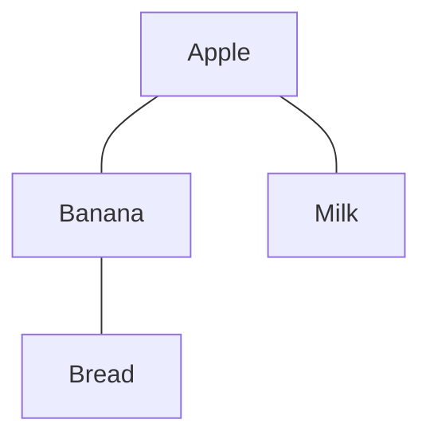
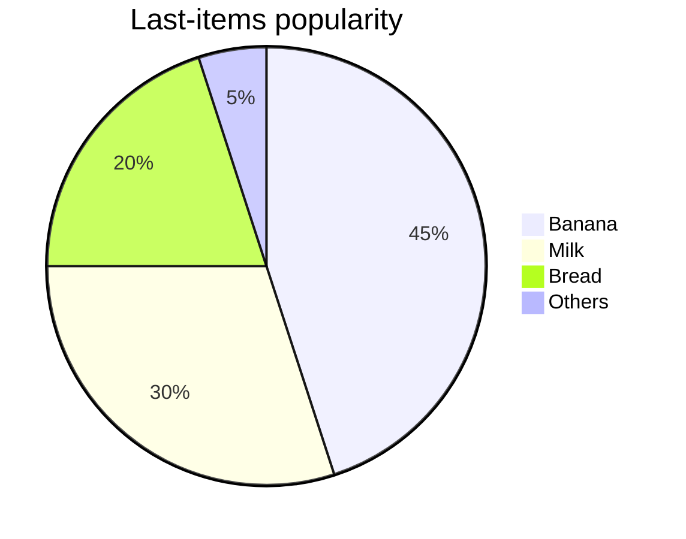
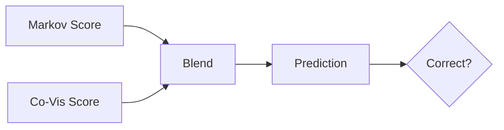
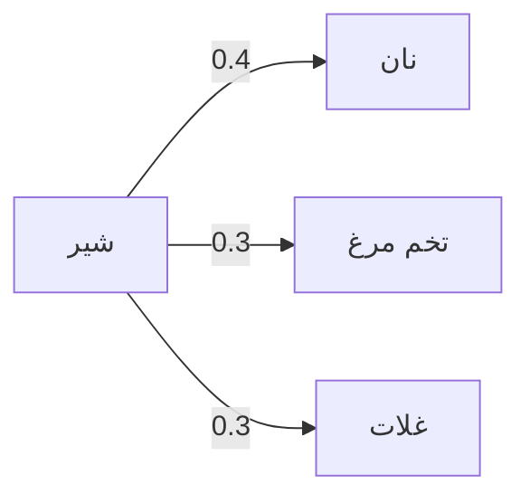
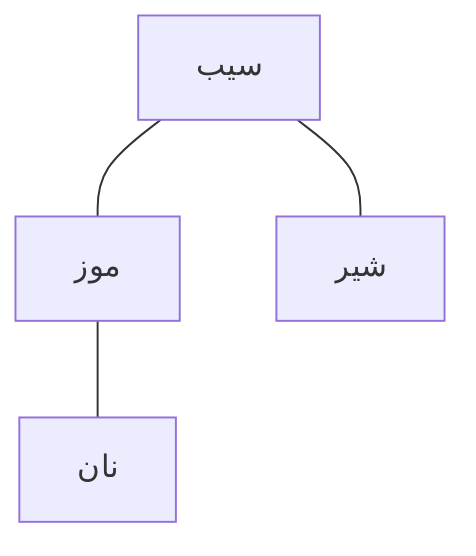
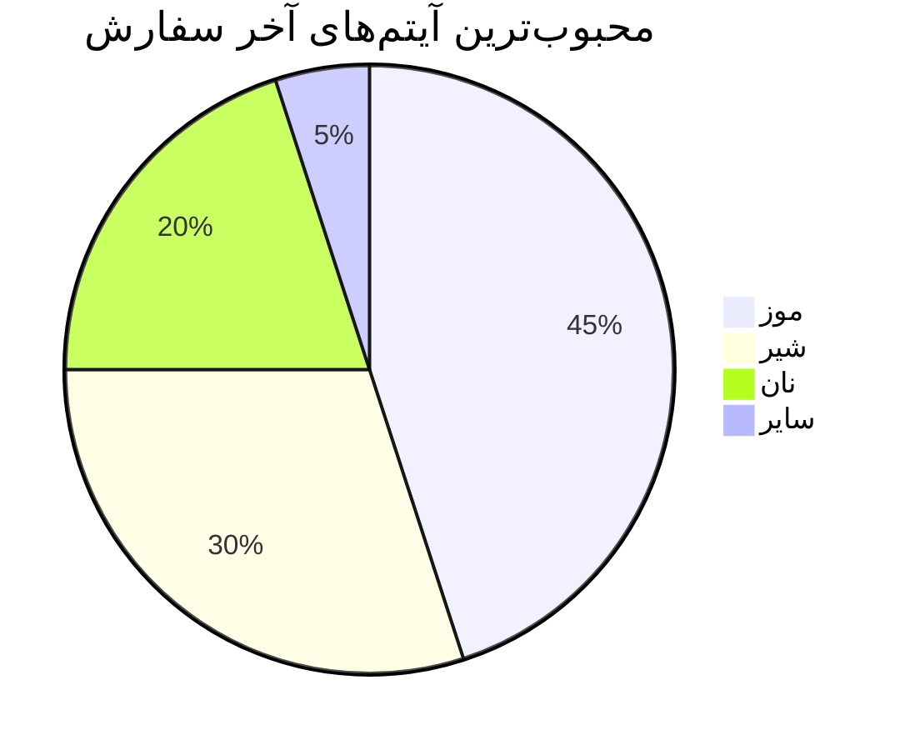

# 📦 Next-Product Prediction Project

## 📖 Overview

This project implements a **sequence-based recommendation system** for predicting the next product a user will add to their cart.
It is built on transaction/order datasets (e.g., Instacart-like format) and evaluates prediction accuracy under different conditions.

The system combines **three algorithms**:

1. **Markov Chain Model** – learns conditional probabilities of transitioning from one product to the next.
2. **Co-Visitation Matrix** – captures products that are often bought together within a short order window.
3. **Popularity Backoff** – falls back to the most popular items when no Markov/Co-Vis candidates exist.

Predictions are blended from Markov and Co-Visitation scores with configurable weights.

---

## ⚙️ Algorithms in Detail

### 🔗 Markov Chain

```mermaid
graph LR
    A[Milk] -->|0.4| B[Bread]
    A -->|0.3| C[Eggs]
    A -->|0.3| D[Cereal]
    B -->|0.6| E[Butter]g
    B -->|0.4| C[Eggs]
```

*Example: If the last product was Milk, the next is predicted based on observed probabilities.*

---

### 🛒 Co-Visitation (Window-based co-occurrence)



*Example: Apple often appears with Banana and Milk → higher co-visitation score.*

---

### ⭐ Popularity Backoff



*When no Markov/Co-vis evidence exists, predict most popular last item.*

---

## 🧮 Final Blending



Final score = `blend_markov * MarkovScore + blend_cov * CoVisScore`

---

## 🚀 Usage

### 1. Input format

CSV file with columns:

* `order_id`
* `product_id`
* `add_to_cart_order`
* `reordered`

### 2. Run the program

```bash
python main.py input.csv output.xlsx
```

### 3. Output

* **Summary** – metrics & overall accuracy
* **Predictions** – per-order predictions
* **Metrics\_k=1/2/3** – evaluation at different hidden steps
* **Top\_Errors** – most common wrong predictions
* **Model\_TopTransitions** – transition probabilities

Logs go into `log/` with timestamps.

---

# 🇮🇷 پروژه پیش‌بینی محصول بعدی

## 📖 معرفی

این پروژه یک **سیستم پیشنهاددهنده مبتنی بر دنباله خرید** است که پیش‌بینی می‌کند کاربر در سفارش خود چه محصولی را بعداً به سبد خرید اضافه خواهد کرد.

این سیستم ترکیبی از سه الگوریتم است:

1. **مارکوف چین** → احتمال انتقال از یک محصول به محصول بعدی.
2. **ماتریس هم‌خرید (Co-Visitation)** → محصولات خریداری‌شده در کنار هم.
3. **محبوبیت (Popularity Backoff)** → fallback بر اساس پرطرفدارترین محصولات.

---

## ⚙️ الگوریتم‌ها (با دیاگرام‌ها)

### 🔗 مارکوف چین



---

### 🛒 هم‌خرید



---

### ⭐ محبوبیت



---

## 🚀 نحوه اجرا

```bash
python main.py input.csv output.xlsx
```

خروجی در فایل Excel شامل:

* **Summary** – خلاصه نتایج
* **Predictions** – پیش‌بینی‌ها
* **Metrics\_k=1/2/3** – متریک‌ها برای سناریوهای مختلف

لاگ‌ها در پوشه `log/` ذخیره می‌شوند.
